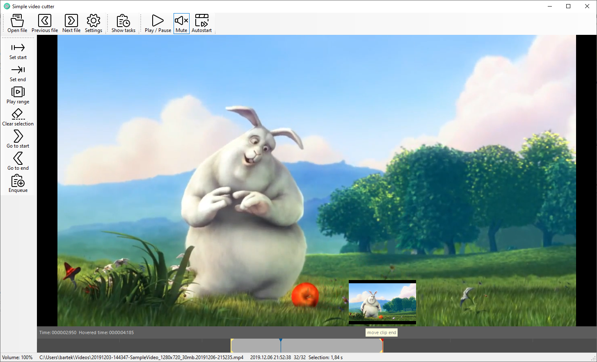

# simple-video-cutter

Windows-based tool to efficiently browse and cut video footage

## Goal

Let's imagine you have hours of video footage, dozens of files (videos from your vacations, material copied from your action camera or a drone etc.). 
Usually only a small portion of this material is worth keeping. So you would like to check the whole material and extract the most interesting/best 
parts as separate videos. And this is where the simple-video-cutter tool comes in. It helps you to quickly browse the videos, preview them and 
extract interesting parts into separate video files. 

The main goal is to make this process as efficient as possible. 
You don't have to select the next file from disk manually, just press "next" and next file (ordered by date) is loaded automatically. 
Location and filenames of created video cuts are assigned automatically basing on patterns specified in the configuration. 
The extraction process is done in background (by ffmpeg), so you can work with next material whilst the previous tasks are being processed. 

## How to use 

### Starting for the first time: 
- start SimpleVideoCutter.exe
- once started, the config.json is created in the current directory
- close SimpleVideoCutter.exe and adjust config.json (please at least ensure the ffmpeg path is valid)
- you are ready to go 

### Working with the tool:
- start SimpleVideoCutter.exe
- open a video file 
- the video playback starts automatically; press space to pause/resume (or click in the video area)
- select a position and click 'S' to mark start of your cut 
- click 'E' to mark end of your cut 
- click 'Enqueue clip task' to add task to the queue. 
  The ffmpeg will be used to extract selected portion of the video and save it in a new file. 
- click 'Show tasks' to see list of pending and running tasks

## To do
- configure options in a dialog (currently one need to modify config.json file manually)
- open dialog to select ffmpeg location 
- allow to configure ffmpeg options when (e.g. convert ot a different format / size etc.) 
- improve timeline control (show seconds ticks etc. )
- extend list of variables that can be used in file patterns 
- jump to first/last video file in the current directory 
- jump to next/prev directory (sibling to current directory)

## Known issues
- sometimes the program freezes (how to fix: [see more here](https://github.com/ZeBobo5/Vlc.DotNet/wiki/Vlc.DotNet-freezes-(don't-call-Vlc.DotNet-from-a-Vlc.DotNet-callback)))
- lack of proper error handling in some border cases (IO errors etc.) 
- location on timeline not updated correctly when video reaches the end 
  (sometimes the marker stays a bit before the actual end). 

