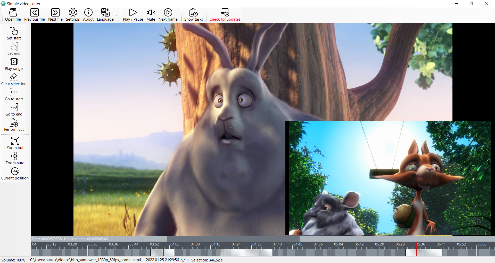

# simple-video-cutter

Windows-based tool for efficient browsing and cutting video footage

See also screenshots of localized versions: 
[Polish](doc/screenshots/screenshot_pl.png)
[German](doc/screenshots/screenshot_de.png)
[French](doc/screenshots/screenshot_fr.png)
[Italian](doc/screenshots/screenshot_it.png)
[Spanish](doc/screenshots/screenshot_es.png)
[Japanese](doc/screenshots/screenshot_ja.png)
[Chinese (simplified)](doc/screenshots/screenshot_zhcn.png)

Translations are mostly machine based (DeepL). Please contact me if you can help to improve translations in your language.

## Goal

Let's imagine you have hours of video footage, dozens of files (videos from your vacations, material copied from your action camera or a drone etc.). 
Usually only a small portion of this material is worth keeping. So you would like to check the whole material and extract the most interesting/best 
parts as separate videos. And this is where the simple-video-cutter tool comes in. It helps you quickly browse your videos, preview them and 
extract interesting parts into separate video files. 

The main goal is to make this process as efficient as possible. 
You don't have to select the next file from disk manually, just press "next" and next file (ordered by date) is loaded automatically. 
Location and filenames of created video cuts are assigned automatically basing on patterns specified in the configuration. 
The extraction process is done in background (by [FFmpeg](http://ffmpeg.org/)), so you can work with next material whilst the previous tasks are being processed. 

## How to use 

### Starting for the first time: 

(Check also translations in [README.txt](README.txt))

- Download the release by [clicking here](https://github.com/bartekmotyl/simple-video-cutter/releases). Click on 'Assets' to see release files. 
- Unzip release package into a directory.   
- Start `SimpleVideoCutter.exe` in that directory
- As [FFmpeg](http://ffmpeg.org/) is required to work with SimpleVideoCutter, you can decide to let SimpleVideoCutter download FFmpeg automatically or you may also download FFmpeg yourself (FFmpeg can be downloaded for free from [FFmpeg release page](https://www.gyan.dev/ffmpeg/builds/)) and set it's path in the Settings dialog.  
- Click OK to save settings 
	
Note: see [below](#portable-installation)  in case you are going to install SimpleVideoCutter in a directory where users do not have write access. 
	
### Working with the tool:
- Open a video file 
- The video playback starts automatically; press space to pause/resume (or click in the video area)
- You can navigate back and forth through video using timeline control at the botom of the screen. Use mouse wheel (with control key pressed) to zoom in and out the timeline. Mouse wheel without control key scrolls the timeline forward and backward. Press shift key for even faster scrolling/zooming. 
- Select a position and press `[` (or click the correspnding button) to mark start of your cut  
- Press `]` to mark end of your cut 
- Press `E` (or click 'Enqueue' button) to add task to the queue. 
  Selected portion of the video will be extracted (with help of FFmpeg) and saved in a new file. 
- You can inspect pending and running tasks in the tsks list area. Tasks are processed automatically and disappear once completed. 
Feel free to open next file (and add next tasks) while task is still in progress - they do not interfere with each other and just queue up. 
- Use Previos / Next buttons to quickly open next or previous file in the same directory. 

### Settings
In the settings window you can adjust some options, especially directory and filename pattern of the output files. 
Supported variables are: 
- `{FileName}` - name of the input video file (with extension)
- `{FileNameWithoutExtension}` - name of the input video file (without extension)
- `{FileExtension}` - extension of the input video file (with dot)
- `{FileDate}` - last modification date of the input file (in format `yyyy-MM-dd-HHmmss`)
- `{Timestamp}` - current timestamp (in format `yyyyMMddHHmmss`)
- `{UserVideos}` - shortcut for `Environment.SpecialFolder.MyVideos`
- `{UserDocuments}` - shortcut for `Environment.SpecialFolder.MyDocuments`
- `{MyComputer}` - shortcut for `Environment.SpecialFolder.MyComputer`
- `{SameFolder}` - allows to save files in same folder when original video file is located

### Portable installation
It is possible to install SimpleVideoCutter into a non-writable directly. In this case one has to manually install FFmpeg and configure its path in the settings.
Configuration file by default is saved in `C:\Users\<username>\AppData\Local\SimpleVideoCutter` (which should be writable for end users). Alternatively, the following command line options can be used to specify different location of config file: 
* `--configCurrentFolder` - in the same folder where exe file is located
* `--configLocalApplicationData` - in the `AppData\Local folder` (this is the default)
* `--configApplicationData` - in the `AppData\Roaming` folder (this means the file is copied when user logs in on another machine in domain environment). Please note this option may be useful only if ffmpeg path points to a shared resource as well (e.g. network drive) or it is expected ffmpeg is always installed in the same place on all machines.

## Icons 

- [streamline icons](https://streamlineicons.com)
- [movie icon](https://www.freeiconspng.com/img/15157)

## Contact

Email: [simple.video.cutter@gmail.com](mailto:simple.video.cutter@gmail.com)
